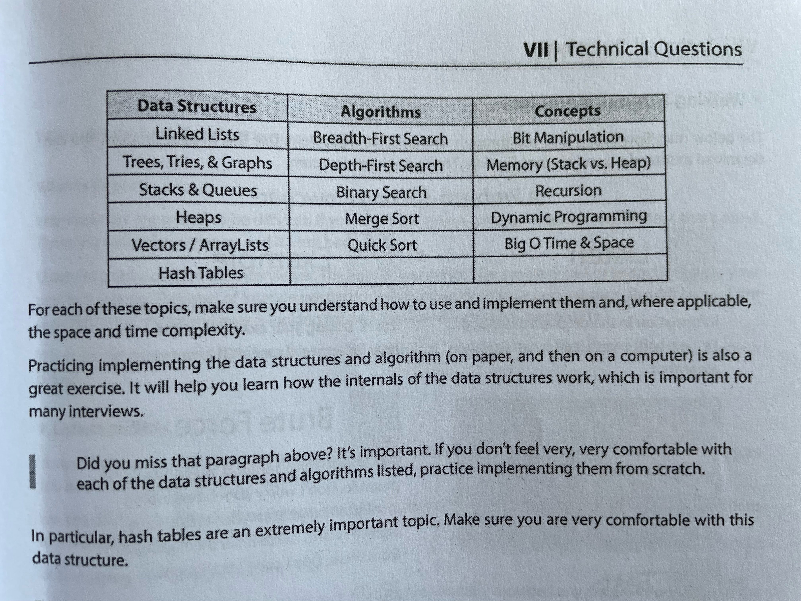

# bingo

The gateway to technical competence.

---

This repository is made from a table in the book called "Cracking The Coding Interview"

It is an attempt to discover and understand everything and more in the said table. See the image down below.

  

There are 29 different python notebooks here.

One by one. Let's go.

- [ ] vectors_arraylists.ipynb

- [ ] operators_and_methods.ipynb

- [ ] two_pointers.ipynb

- [ ] sliding_window.ipynb

- [ ] strings.ipynb

- [ ] stacks_queues.ipynb

- [ ] heaps.ipynb

- [ ] hashtables.ipynb

- [ ] trees.ipynb

- [ ] big_o_time_space.ipynb

- [ ] binary_search.ipynb

- [ ] bfs.ipynb

- [ ] dfs.ipynb

- [ ] bit_manipulation.ipynb

- [ ] dynamic_programming.ipynb

- [ ] recursion.ipynb

- [ ] tries.ipynb

- [ ] graphs.ipynb

- [ ] linked_lists.ipynb

- [ ] merge_sort.ipynb

- [ ] quick_sort.ipynb

- [ ] sorts.ipynb

- [ ] memory.ipynb

- [ ] intervals.ipynb

- [ ] backtracking.ipynb

- [ ] greedy.ipynb

- [ ] advanced_graphs.ipynb

- [ ] dynamic_programming_2d.ipynb

- [ ] math_and_geometry.ipynb